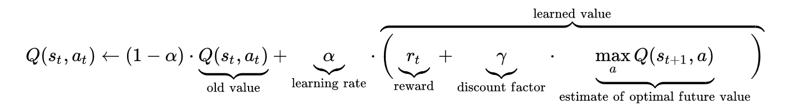
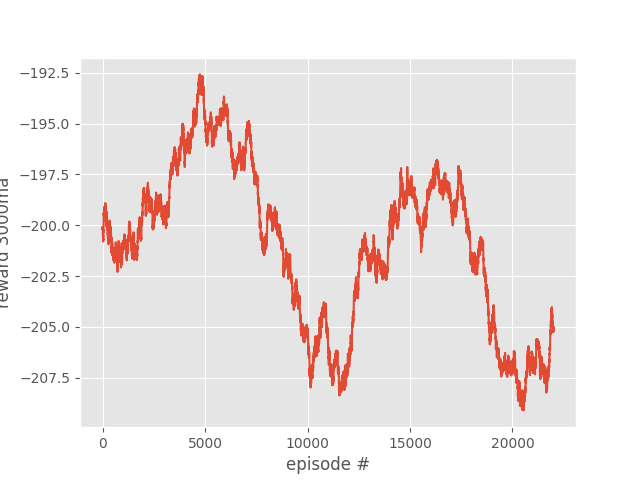
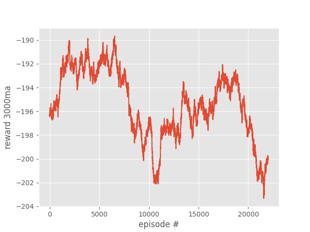

# Survival-Extint : Reinforcement-Learning
<B><h3>INTRODUCTION :</h3></B>
Survial Extint is an Reinforcement Learning based environment in which we have our agent
who struggles for his survival to reach its destination, here we take it as Food. 
In his way he have to face his Enemy who is way more powerful than him.  If they both have a dual with each 
other. Our agent is sure to fail ! 
But here is a twist, <B>Reinforcement Learning (RL)</B> is there to help him. RL deploys <B>Q LEARNING</B> to help our agent. 

<B><h3>Q-LEARNING :</h3></B>
Q-learning is a model-free reinforcement learning algorithm to learn the value of an action in a particular state. It does not require a model of the environment (hence "model-free"), and it can handle problems with stochastic transitions and rewards without requiring adaptations (sources : <a href = "https://en.wikipedia.org/wiki/Q-learning">Wikipedia</a>). 
Here, is an image to show the update rule of Q-Learning.  
 
<B><h3>FINAL SHOWDOWN :</h3></B>
Getting well equipped with Q-leaning in its arsenal. Our agent started its journey to reach its destination. 
Here, we have two cases: 
1. Enemy and Food both are at one position
2. Both Enemy and Food are moving

Here, we have a short video to show its performance in both cases:
1. Both are fixed: 
<video width="520" height="240">
  <source src="live_demo/survial_extint_stop_mode.mp4" type="video/mp4">
</video>

2. Both are moving: 
<video width="520" height="240">
  <source src="live_demo/survival_extint_moving_mode.mp4" type="video/mp4">
</video>

<B><h3>RESULTS :</h3></B>
Here, are plots between average reward achieved over 3000 epochs versus the number of epoch.

<B><h4>1. When both were stationary:</h4></B> 

 
<B><h4>2. When both were moving:</h4></B> 

